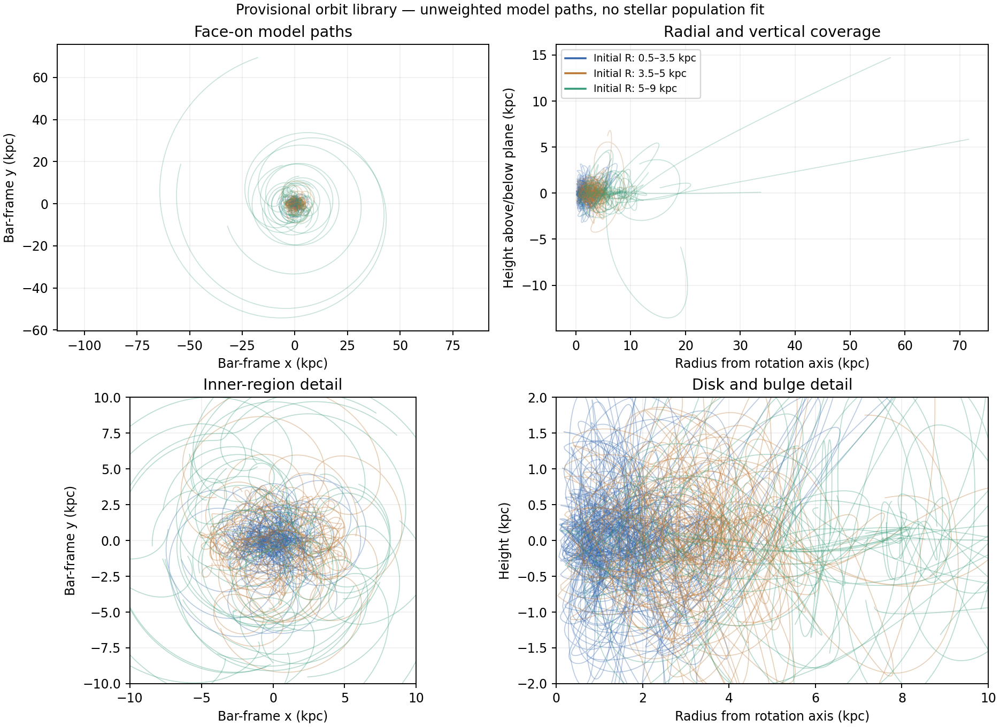

# A screened, training-derived candidate orbit library

**The candidate library contains 72 training-derived launch states. 72/72 pass the integration/Jacobi checks, 72/72 pass the sampled-path extra-force refinement check, and 72/72 pass both.** These are model-basis calculations, not a fit to observed stellar populations or fresh holdout evidence.

## What changed in the launch sample

The original 72 provisional seeds were reproduced exactly before applying any new eligibility rule. Sixteen had the previously identified >0.5-arcsecond positional-review flags and one was unassessed by that screen. They should not automatically be treated as reliable measured phase-space states.

The unchanged spatial/chemical selection contains 27,884 training stars: 27,714 pass the existing positional screen, 105 are flagged, and 65 are unassessed. For this provisional library only, seeds are drawn from the position-screened group. The same deterministic, robustly scaled farthest-point algorithm chooses eight starts in each of nine radius/absolute-height regions. It chooses broad coverage, not population weights.

The new set retains 48 old seeds and selects 24 different ones. Seventeen old seeds were ineligible; seven otherwise eligible seeds changed because the algorithm was rerun on the revised pool, including its median and scale. No velocity clipping, gravity-residual selection, fitted force coefficient or per-region speed multiplier was used. The original catalog, moments, roles and seed file are unchanged; a separate eligibility sidecar records all reasons.

An ineligible seed is not an instruction to delete that star from the scientific dataset. A future likelihood needs a declared association/quality model or an appropriate documented selection. This operation only changes starting points for a numerical orbit basis.

## Independent actual-epoch position check

Two public IRSA queries retrieved the actual 2MASS positions and observation times for all 72 selected designations. Propagating the Gaia positions to those dates with the measured mean proper motions gives **0 new flags** at the existing 0.5-arcsecond threshold; the largest separation is **0.490308 arcsec**. The raw query responses, queries and hashes are retained.

The [2MASS catalog documentation](https://www.ipac.caltech.edu/2mass/releases/allsky/doc/ancillary/pscformat.html) defines jdate as the source measurement time and the positional error-ellipse axes in arcseconds. This check uses those recorded dates rather than picking a convenient epoch inside the survey window. It does not turn the threshold into a formal association probability. Crowding, blends, multiplicity and uncertainty calibration can still matter; perspective acceleration and annual-parallax corrections are not fitted in this small-angle propagation.

Three new seeds retain the earlier distance-consistency flags. Passing the position check does not validate their StarHorse distances or resolve shared Gaia inputs. Their flags remain attached. The starts use the same approximate conditional posterior means as before; they are candidate phase-space basis points, not claims to know those stars' exact orbits.

## Spatial coverage

R denotes distance from the Galactic rotation axis. Heights use absolute z for selecting bins, but signed z is retained in the states and trajectories.

| Radius range (kpc) | Absolute-height range (kpc) | Seeds | Positive z | Negative z | Maximum seed speed (km/s) |
|---|---|---:|---:|---:|---:|
| 0.5–3.5 | 0–0.2 | 8 | 4 | 4 | 260.31 |
| 0.5–3.5 | 0.2–0.5 | 8 | 3 | 5 | 340.17 |
| 0.5–3.5 | 0.5–1.5 | 8 | 6 | 2 | 295.91 |
| 3.5–5 | 0–0.2 | 8 | 4 | 4 | 273.44 |
| 3.5–5 | 0.2–0.5 | 8 | 4 | 4 | 297.41 |
| 3.5–5 | 0.5–1.5 | 8 | 3 | 5 | 333.55 |
| 5–9 | 0–0.2 | 8 | 7 | 1 | 357.23 |
| 5–9 | 0.2–0.5 | 8 | 5 | 3 | 360.33 |
| 5–9 | 0.5–1.5 | 8 | 3 | 5 | 469.54 |

Both sides of the plane occur in every region, but the seed counts are not balanced observational weights. The frame and 27-degree bar-angle choice are preserved from the prior transformation. Those observational nuisance choices remain to be varied in inference.

## Integration and force checks

The full-bar empirical-response field and its 37.5 km/s/kpc pattern speed are unchanged. Each state is integrated independently for 0.25 kpc/(km/s), approximately 244 million years, at 501 output times. Tolerances 2e-9, 2e-11 and, when needed, 2e-13 use the existing thresholds: 0.0001 kpc trajectory-position difference, 0.01 km/s velocity difference, and scaled Jacobi drift below 1e-5. Every attempt and domain error is retained.

The force check compares the fine/finer three-dimensional corrections at 36,072 saved locations, normalized to the extra force. The largest checked difference is 0.37839%, against the unchanged 1% target. These checks do not establish continuum convergence, mass-model correctness, resolved distance uncertainties or the density distribution of real stars.

The equations are the known rotating-frame Hamilton equations for a prescribed conservative potential. The extra field uses known QUMOND-style mathematics with the frozen empirical coefficients; this library derives no new photon-transfer or capture law. Initial agreement with the seed stars' mean velocities is by construction and is not a gravity test.

Line density in this figure is not a predicted stellar density. It depends on selected starts, equal time sampling and plotting overlap. The finite integration duration has not yet been shown to produce stationary orbit-occupation kernels.

Two candidate paths reach approximately 59.2 and 71.9 kpc over this interval. Their final radial velocities remain outward. Neither carries the recorded distance-disagreement flag. These finite segments cannot be assumed to sample completed orbits or a stationary population. They are not proof that the corresponding observed stars are escaping; seed uncertainty and the candidate potential remain conditional. The upper panels preserve the full extent, while the lower panels show the inner region.

## What remains before the observational comparison

The next step is to establish duration/phase coverage and position-conditioned velocity support, then fit nonnegative population weights with the same selection and uncertainty treatment across candidate potentials. A 72-orbit library is not assumed complete merely because it is larger than six demonstration paths. The current pass integrates the full-field candidate; equivalent population freedom under ordinary matter is still needed for fair model comparison.

The three distance flags and the larger catalog's association/distance-prior issues remain part of that likelihood work. A StarHorse posterior summary is not an independent distance measurement to multiply by the same Gaia parallax again. Validation and final test observations must remain separate from library and regularization choices; no holdouts were opened here.

The result advances the observational machinery but does not establish the full photon-companion theory. Observable redshift/timing, lossless energy transport, creation/capture, a common lensing response and the deferred total source-energy budget remain separate requirements.

## Reproduction

Run `prepare.py`, `check_epochs.py`, `integrate.py`, `check_field.py`, and `report.py`. Existing download responses are reused after exact-designation checks. Large launch/eligibility tables and trajectories stay in the ignored cache; source IDs are strings in the tracked JSON to preserve their full integer precision. No original source file was changed.
