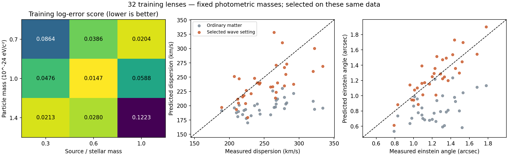

# A shared wave setting improves both training observables

All nine declared parameter settings completed. The same setting gives the lowest dispersion RMS, lowest lens-angle RMS and lowest declared joint score: **m=10^-24 eV/c^2 and deposited-source/stellar mass ratio f=0.6**. It improves both observables relative to the fixed-photometric-mass ordinary-matter benchmark, without adjusting parameters separately for each galaxy.

This is a meaningful **training improvement**, not a validated explanation of photon conversion or extra gravity. We selected the setting on these same 32 systems. Its success must be tested on reserved galaxies with the parameters unchanged, and population/geometry uncertainties still limit the interpretation.

## Declared comparison

Before execution, `grid-protocol.json` specified three common particle masses, 0.7, 1.0 and 1.4 times 10^-24 eV/c^2, and three common source fractions, 0.3, 0.6 and 1.0. The range is a local sensitivity study around the earlier illustrative point, not a global search. All successful and failed runs were to be retained; all nine passed the stated numerical gates.

The protocol ranks cells using

\[
S=\frac1{2N}\sum_i\left[
\ln^2\left(\frac{\sigma_{\mathrm{pred},i}}{\sigma_{\mathrm{obs},i}}\right)
+\ln^2\left(\frac{\theta_{\mathrm{pred},i}}{\theta_{\mathrm{SIE},i}}\right)\right].
\]

This is a **chosen diagnostic objective using standard squared log residuals**, not a new physical formula or a measurement-uncertainty likelihood. It gives comparable weight to fractional errors in the two observables. There is no statistical confidence interval or evidence ratio associated with this score here.

All cells use the same 32 training lenses, fixed rescaled Salpeter population masses, updated I-band radii, spherical isotropic luminous tracer, 1.5-arcsecond seeing assumption and archived static geometry. No stellar masses are refitted to velocity or lensing. The [initial training report](report.md) documents the input assumptions and the [supported-source report](../self-consistent-wave/report.md) gives the known Schrodinger-Poisson equations. Applying those equations to photon-fed companions remains a hypothesis; the equations themselves are established literature.

## Full grid

| m / (10^-24 eV/c^2) | Source fraction f | Dispersion RMS, km/s | Lens-angle RMS, arcsec | Joint score S |
|---:|---:|---:|---:|---:|
| 0.7 | 0.3 | 53.76 | 0.3740 | 0.08639 |
| 0.7 | 0.6 | 43.23 | 0.2403 | 0.03862 |
| 0.7 | 1.0 | 35.04 | 0.2035 | 0.02042 |
| 1.0 | 0.3 | 45.20 | 0.2777 | 0.04757 |
| **1.0** | **0.6** | **31.99** | **0.1440** | **0.01467** |
| 1.0 | 1.0 | 52.50 | 0.4400 | 0.05875 |
| 1.4 | 0.3 | 35.15 | 0.1804 | 0.02128 |
| 1.4 | 0.6 | 38.97 | 0.2587 | 0.02799 |
| 1.4 | 1.0 | 96.24 | 0.5914 | 0.12229 |

The paired ordinary-matter benchmark has dispersion RMS 62.77 km/s, lens-angle RMS 0.4628 arcseconds and score 0.14085. The original wave choice f=1 at m=10^-24 has score 0.05875. The selected point improves all three summaries, rather than improving one measurement at the expense of the other under the declared score.

At the selected setting, the median predicted/measured dispersion is 0.960, and the median predicted/SIE lens angle is 1.044. Mean residuals are -11.98 km/s and +0.0221 arcseconds. Being close in the median does not remove the scatter: the RMS remains 31.99 km/s and 0.1440 arcseconds.

The lower-mass/higher-fraction and higher-mass/lower-fraction alternatives also perform reasonably relative to this local grid. Thus these data and assumptions do not identify a precise universal particle mass or accumulation fraction. An interior minimum among nine cells is not proof of a unique or global optimum.

The dashed lines indicate exact agreement. Both axes describe the same measured/predicted observable; the points are not new independent datasets. The scatter plot shows that some systems remain substantially discrepant despite improved averages.

## Verification

All nine cells contain exactly the same 32 systems and stellar masses. The ordinary benchmark and the original shared-wave point reproduce the earlier calculations exactly in the saved numeric predictions. Across the grid, maximum source-normalization error is below 9.4e-9, maximum normalized virial residual below 1.2e-6, and maximum discrepancy between line-of-sight bending and independent projected-mass bending below 2.3e-10 relative. No numerical failure was silently dropped.

There are 288 wave-model configurations of 32 observed systems, not 288 independent galaxies. Shared use of the same data is the reason this is calibration, not a holdout result. The original model assumptions, conditional stellar population normalization and lack of a complete imaging/orbit likelihood still apply.

## What is—and is not—established

We have a supported field model with a common setting that brings stellar motions and lensing closer to the data. That is stronger than specifying an extra acceleration separately for each galaxy, and it gives us a concrete candidate to evaluate outside the training sample.

It does not establish that photons create this field, that captured energy reaches f=0.6, that the configurations are collectively stable or that redshift and event timing arise from the same action. The fitted f is a source mass ratio, not a calculated photon-energy conversion efficiency. The deferred total supply budget remains untested.

The next comparison should keep this training-selected pair fixed and evaluate the existing validation-role lenses with the same independently estimated stellar masses and observational assumptions. Their earlier empirical-profile results are already exposed, so this would be a reused validation sample, not pristine blinding. The untouched test-role predictions should remain reserved until a final model and evaluation protocol are fixed. No reserved score is opened by this grid pass.

`parameter-grid/selected-calibration.json` records the chosen setting and input hashes. It is a frozen training calibration for the next conditional comparison, not a final theory selection. Before calling any result a strong case, the full measurement uncertainties, model sensitivity and photon mechanism must be addressed.

Reproduce with `python research_work/results/wave-lens-training/run_grid.py`, then `verify_grid.py` and `plot_grid.py` in this directory. The plotting script additionally requires Matplotlib. Every cell retains its predictions, equilibrium checks, scores and execution log. `parameter-grid/summary.json` gives the complete score table; `parameter-grid/verification.json` records consistency checks.
